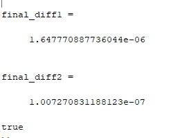
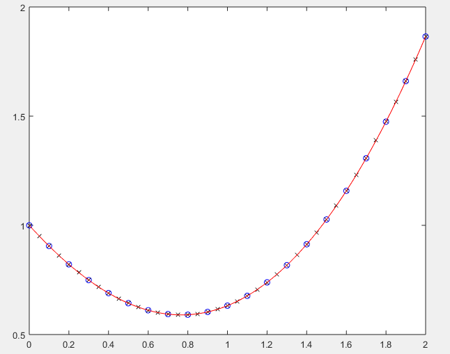

# 书本P387 练习一

姓名：王永锋
学号：16337237

在本题中，我使用matlab对本题所涉及的微分方程进行了计算，并分析了误差。

需要注意的是：

$$ y' = t^2 - y $$
$$ y(0) = 1 $$
$$ y(t) = -e^{-t} + t^2 - 2t + 2 $$

## (a)运行程序，计算结果

## (b)比较精确解和近似解

该步骤需要比较(a)中的两个近似解与精确解。

如图所示，h=0.2时，下面为20次步运算中，近似解与精确解的差

```
diff1 =

   1.0e-05 *

         0
   -0.0126
   -0.0249
   -0.0366
   -0.0479
   -0.0587
   -0.0689
   -0.0787
   -0.0880
   -0.0968
   -0.1051
   -0.1129
   -0.1202
   -0.1272
   -0.1337
   -0.1398
   -0.1455
   -0.1508
   -0.1558
   -0.1604
   -0.1648
```

当h=0.1时，下面为40次运算中，近似解与精确解的差

```
diff2 =

   1.0e-06 *

         0
   -0.0039
   -0.0078
   -0.0116
   -0.0153
   -0.0190
   -0.0225
   -0.0260
   -0.0294
   -0.0328
   -0.0361
   -0.0392
   -0.0423
   -0.0454
   -0.0483
   -0.0512
   -0.0540
   -0.0567
   -0.0593
   -0.0619
   -0.0644
   -0.0668
   -0.0692
   -0.0714
   -0.0737
   -0.0758
   -0.0779
   -0.0799
   -0.0818
   -0.0837
   -0.0855
   -0.0873
   -0.0890
   -0.0906
   -0.0922
   -0.0938
   -0.0953
   -0.0967
   -0.0981
   -0.0994
   -0.1007
```


## (c)最终全局误差

当h减半的时候，(a)中的最终全局误差是否与预期相符？


为了判断是否相符，我使用下面的公式进行判断

$$ E(h=0.1) < \frac{1}{16} E(h=0.2) $$

```matlab
final_diff1 = abs(ff(2) - R1(21,2))
final_diff2 = abs(ff(2) - R2(41,2))
if (final_diff2 < final_diff1/16)
    disp ( 'true' )
else
    disp ( 'false' )
end
```

输出的结果如图所示,的确显示了true。表明最终全局误差与预期相符。



## (d)画出近似解和精确解

如下图所示，红线为精确解，篮圈为h=0.2时的解，黑叉为h=0.1时的解。由于精确度都比较高，从图上看不出误差的差异。




## 附录

这里放本次作业所涉及到的代码

### c9_rk4函数

这个函数就是课本上的函数

```matlab
function R = c9_rk4( f, a, b, ya, M )
% 4??????
%C9_RK4 Summary of this function goes here
%   a, b: left and right end points
%   ya : initial condition y(a)
%   M the number of steps
h = (b-a)/M;
T = zeros(1, M+1);
Y = zeros(1, M+1);
T = a:h:b;
Y(1) = ya;
for j = 1:M
    k1 = h * feval(f, T(j), Y(j));
    k2 = h * feval(f, T(j)+h/2, Y(j)+k1/2);
    k3 = h * feval(f, T(j)+h/2, Y(j)+k2/2);
    k4 = h * feval(f, T(j)+h, Y(j)+k3);
    Y(j+1) = Y(j) + (k1 + 2*k2 + 2*k3 + k4)/6;
end
R = [T' Y'];

end

```

### 运行脚本

```matlab
tt = 0:0.01:2;
f = @(t, y)t*t-y;
ff = @(t)-exp(-t) + t.*t - 2*t + 2;
% true value
ye = ff(tt);
a = 0;
h = 0.1;
M = 20;
b = a + M * h;
ya = 1;
R1 = c9_rk4(f, a, b, ya, M)
a = 0;
h = 0.05;
M = 40;
b = a + M * h;
ya = 1;
R2 = c9_rk4(f, a, b, ya, M)

format long

% second
diff1 = ff(R1(:,1)) - R1(:,2)
diff2 = ff(R2(:,1)) - R2(:,2)
R1(21,2)
R2(41,2)

% third
final_diff1 = abs(ff(2) - R1(21,2))
final_diff2 = abs(ff(2) - R2(41,2))
if (final_diff2 < final_diff1/16)
    disp ( 'true' )
else
    disp ( 'false' )
end

% fourth
plot(R1(:,1), R1(:,2), 'bo', R2(:,1), R2(:,2), 'kx', tt, ye, 'r-');
```
